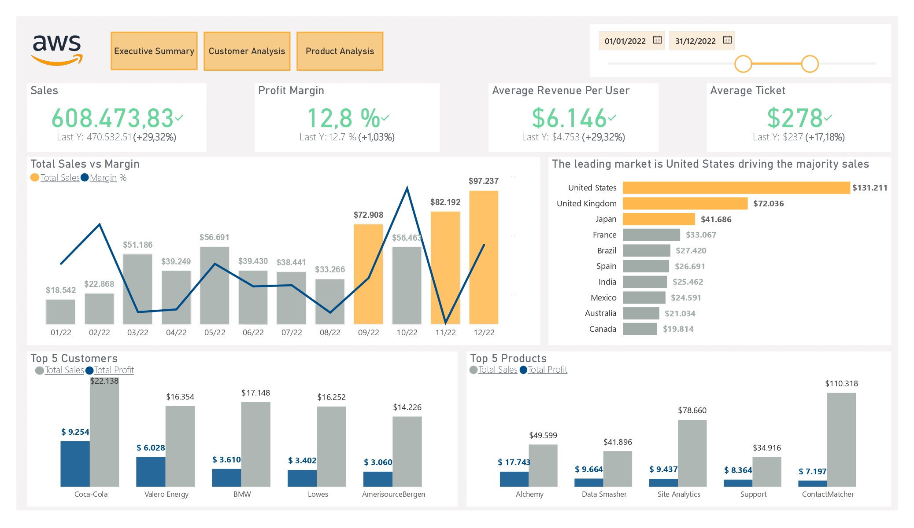
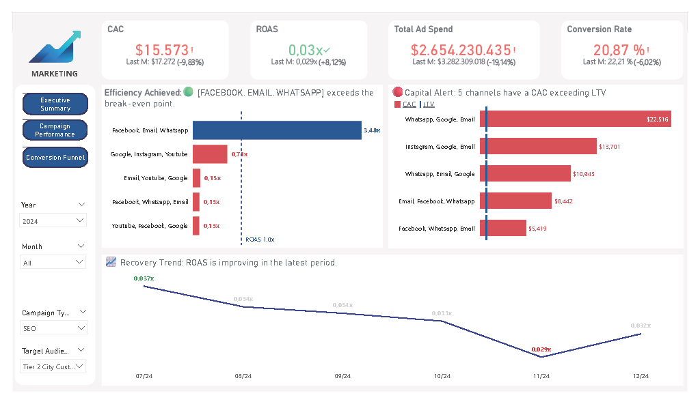
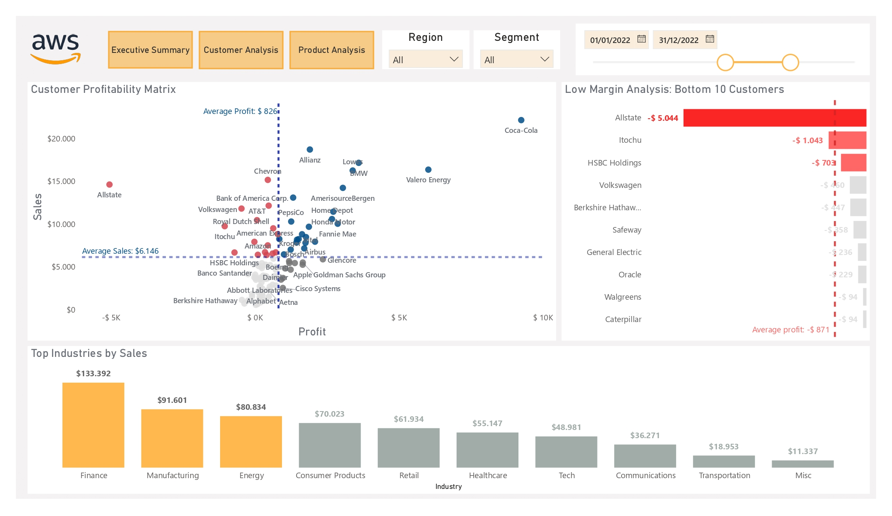
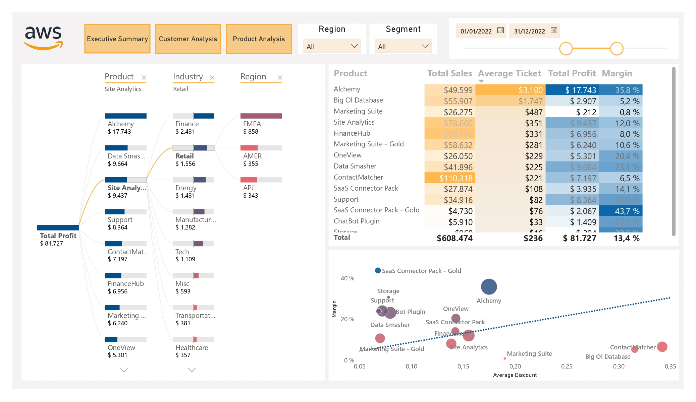
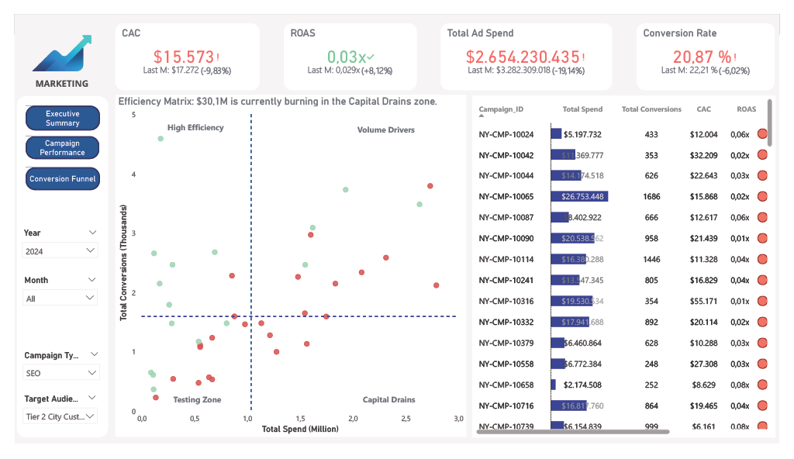
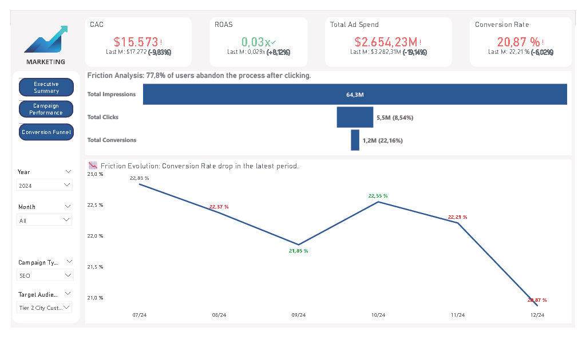

  🌐 <a href="#english">English</a> | 🇦🇷 <a href="#español">Español</a>

---

<h1 id="english">📊 Strategic & Tactical Dashboards: SaaS Profitability & Marketing ROI</h1>

  
  

This repository contains two End-to-End Business Intelligence projects engineered to solve critical financial dilemmas: margin erosion in scaling B2B SaaS models and inefficient capital allocation in marketing campaigns. 

Built strictly upon the principles of *Storytelling with Data* and Gestalt psychology, these analytical tools are designed to reduce executive cognitive load, delivering actionable answers in under 5 seconds.

---

## 📌 Project 1: Strategic SaaS Profitability Dashboard

**Live Demo:** [View Dashboard on NovyPro](https://www.novypro.com/profile_about/1767415426369x736698064812161000?Popup=memberProject&Data=1767568431722x225861121663451000)

### The Business Context
Growing SaaS companies often face a dangerous paradox: climbing sales volumes accompanied by stagnant net utility. The goal of this project was to diagnose the quality of revenue, identifying customer segments that drive high volume but destroy operational value.

### Technical Architecture & Challenges
*   **Data Engineering (ETL & Modeling):** Automated raw AWS sales data ingestion pipelines using Power Query (M). Architected a highly optimized **Star Schema**, ensuring referential integrity and enabling strict Query Folding to maintain peak performance across large transactional datasets.
*   **Advanced Analytics (DAX):** Replaced static metrics with Dynamic Segmentation algorithms utilizing advanced DAX patterns (disconnected tables and virtual variables). This enables real-time client classification based on contribution margins, uncovering financial anomalies hidden by simple averages.
*   **Data UX (User Experience):** Interface designed under the Cognitive Load Theory framework:
    *   *Noise Reduction:* Ruthless elimination of non-data ink to maximize executive working memory.
    *   *Directed Attention:* Strategic use of pre-attentive attributes (color and spatial positioning) to guide the user's eye directly to critical insights.

  
  
  
   
  <i>Watch the Dynamic Segmentation in action:</i> 
  <video src="imgs/SaaS/grabacion-SaaS.mp4" width="80%" controls></video>

---

## 📌 Project 2: Marketing ROI & CAC Optimization

### The Business Context
Marketing departments often struggle with "black holes" in their budget. This project transforms raw advertising campaign data into a visual decision-making engine for C-level executives. The core objective: Answer "Where are we bleeding money, and which campaigns must be killed today?" instantly.

### Multi-Tiered Analytical Depth
To eliminate technical noise, the architecture is divided into three analytical layers:

1.  **Executive Summary:** A rapid scan of business health. Utilizes large-number KPIs (Total Spend, Revenue, ROAS, CAC) without distracting borders. A bullet chart visually contrasts baseline LTV against the CAC ceiling, paired with a traffic-light conditional formatting system that aggressively flags destructive channels (ROAS < 1.0) in red.
2.  **Tactical Campaign Performance:** Designed for analytical "precision surgery". A scatter plot segments campaigns into 4 quadrants via reference lines, isolating "gold mines" (low spend, high conversion) from "black holes". An integrated data-bar matrix with alert icons allows users to pause losing campaigns without processing raw numerical tables.
3.  **Friction Analysis:** A direct focus on sales funnel drop-offs. Features a horizontal funnel chart displaying exact percentage losses between impressions, clicks, and conversions. A supplementary line chart isolates the core metric (Conversion Rate %) to evaluate funnel efficiency week-over-week.

### Actionable Insight
A zero-code analytical product that delivers immediate financial answers, allowing leadership to confidently reallocate budget toward genuinely profitable channels.

  
  
  
   
  <i>Exploring tactical campaign performance:</i> 
  <video src="imgs/Marketing/grabacion-marketing.mp4" width="80%" controls></video>

## 🛠️ Tech Stack
*   **Business Intelligence:** Microsoft Power BI
*   **Languages & Scripts:** DAX (Advanced), Power Query (M), SQL
*   **Data Modeling:** Dimensional Modeling (Star Schema), Query Folding
*   **Design Frameworks:** Cognitive Load Theory, Gestalt Laws, Storytelling with Data

---
---

<h1 id="español">📊 Dashboards Estratégicos: Rentabilidad SaaS y Marketing ROI</h1>

  
  

Este repositorio contiene dos proyectos de Inteligencia de Negocios End-to-End diseñados para resolver dilemas financieros críticos: la erosión de márgenes en modelos B2B SaaS y la asignación ineficiente de capital en campañas de marketing.

Construidas estrictamente sobre los principios de *Storytelling con Datos* y la psicología de la Gestalt, estas herramientas analíticas están diseñadas para reducir la carga cognitiva ejecutiva, entregando respuestas accionables en menos de 5 segundos.

---

## 📌 Proyecto 1: Dashboard Estratégico de Rentabilidad SaaS

**Demo Interactiva:** [Ver Dashboard en NovyPro](https://www.novypro.com/profile_about/1767415426369x736698064812161000?Popup=memberProject&Data=1767568431722x225861121663451000)

### El Contexto de Negocio
Las empresas SaaS en crecimiento suelen enfrentar una paradoja peligrosa: el aumento del volumen de ventas acompañado de un estancamiento en la utilidad neta. El objetivo fue diagnosticar la calidad de los ingresos, identificando segmentos de clientes que, pese a generar alto volumen, destruyen valor operativo.

### Arquitectura Técnica y Desafíos
*   **Ingeniería de Datos (ETL & Modelado):** Automatización de la ingesta de datos brutos de ventas (AWS) mediante Power Query (M). Diseñé un **Esquema en Estrella (Star Schema)** altamente optimizado para asegurar la integridad referencial y habilitar el *Query Folding*, garantizando un alto rendimiento sobre grandes volúmenes transaccionales.
*   **Analítica Avanzada (DAX):** Se reemplazaron métricas estáticas por algoritmos de Segmentación Dinámica utilizando patrones avanzados de DAX (tablas desconectadas y variables virtuales). Esto clasifica a los clientes en tiempo real según su margen de contribución, detectando anomalías que los promedios ocultan.
*   **Data UX (Experiencia de Usuario):** Interfaz diseñada bajo la Teoría de la Carga Cognitiva:
    *   *Reducción de Ruido:* Eliminación estricta de elementos gráficos innecesarios para maximizar la memoria de trabajo.
    *   *Atención Dirigida:* Uso estratégico de atributos preatentivos (color y posición) para guiar la vista hacia los insights críticos al instante.

  
  
  
   
  <i>Demostración de la Segmentación Dinámica:</i> 
  <video src="imgs/SaaS/grabacion-SaaS.mp4" width="80%" controls></video>

---

## 📌 Proyecto 2: Optimización de ROAS y CAC (Marketing)

### El Contexto de Negocio
Los departamentos de marketing suelen luchar contra gastos ineficientes. Este proyecto transforma datos brutos publicitarios en una herramienta de decisión visual para perfiles C-level. El objetivo central: Responder de inmediato "¿Dónde estamos perdiendo dinero y qué campañas debemos apagar hoy mismo?".

### Profundidad Analítica en 3 Niveles
Para eliminar el ruido técnico, la arquitectura se dividió en tres capas:

1.  **Resumen Ejecutivo:** Un escaneo rápido de la salud del negocio. Utiliza números en grande (Total Spend, Revenue, ROAS, CAC) sin bordes distractores. Incluye un gráfico de viñetas (bullet chart) que contrasta el LTV frente al límite del CAC, y un formato condicional tipo semáforo que resalta en rojo intenso los canales destructivos (ROAS < 1.0).
2.  **Rendimiento Táctico:** Diseñado para la "cirugía de precisión". Un gráfico de dispersión segmenta las campañas en 4 cuadrantes, aislando las "minas de oro" (poco gasto, alta conversión) de los "agujeros negros". Una matriz limpia con barras de datos e íconos de alerta permite pausar campañas perdedoras instantáneamente.
3.  **Análisis de Fricción:** Enfoque directo en las caídas del embudo de ventas. Presenta un gráfico de embudo horizontal que expone el porcentaje exacto de pérdida entre impresiones, clics y conversiones. Un gráfico de líneas aísla la Tasa de Conversión (%) para evaluar la eficiencia temporal semana a semana.

### Información Accionable
Un producto analítico *zero-code* que entrega respuestas financieras directas, permitiendo a la dirección reasignar el presupuesto hacia los canales verdaderamente rentables.

  
  
  
   
  <i>Explorando el rendimiento táctico de campañas:</i> 
  <video src="imgs/Marketing/grabacion-marketing.mp4" width="80%" controls></video>

## 🛠️ Stack Tecnológico
*   **Inteligencia de Negocios:** Microsoft Power BI
*   **Lenguajes:** DAX (Avanzado), Power Query (M), SQL
*   **Modelado de Datos:** Modelado Dimensional (Star Schema), Query Folding
*   **Marcos de Diseño:** Teoría de la Carga Cognitiva, Leyes de Gestalt, Storytelling con Datos
